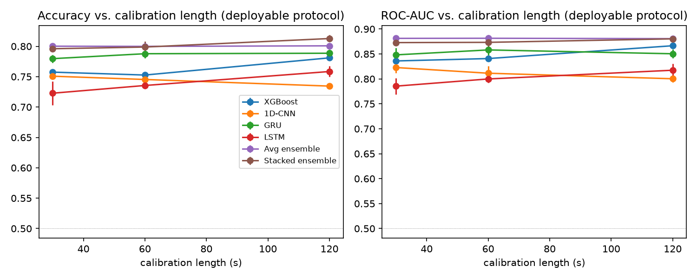
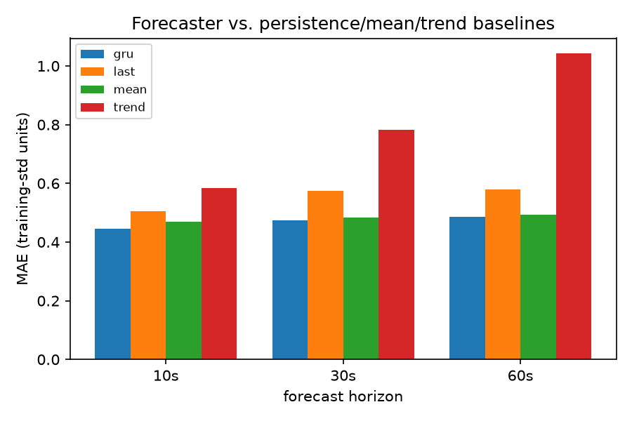
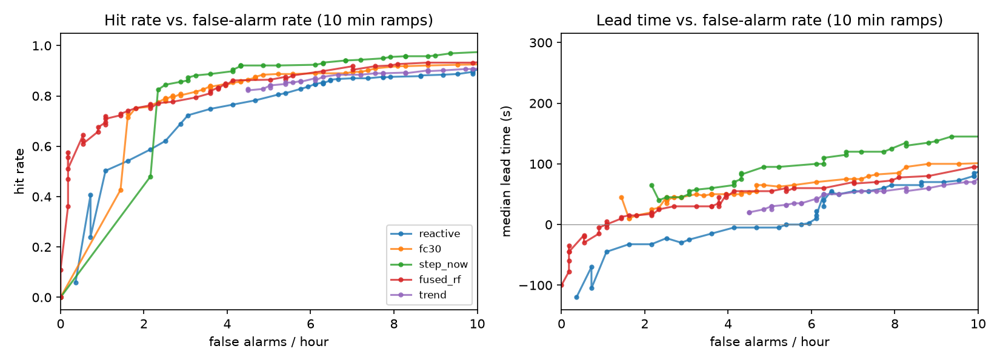
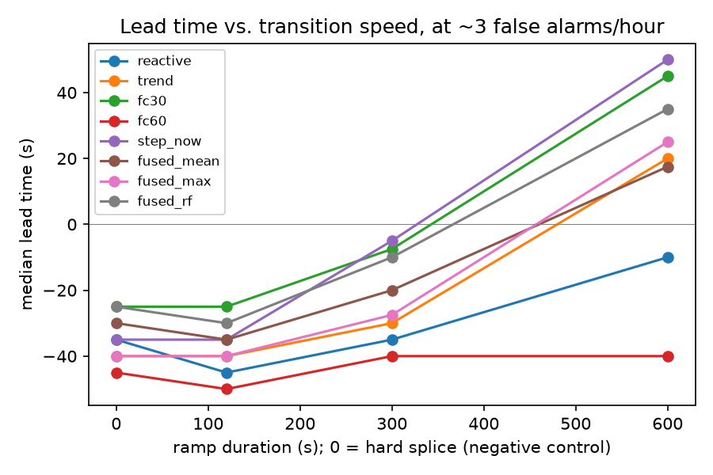

# DriveGuard: Results Summary

Predictive driver-drowsiness detection from a webcam (ICPS project).
This document reports only the **training/evaluation results** and the **live-demo results**.

---

## 1. Training and evaluation results

### 1.1 Setup

| Item | Value |
|---|---|
| Dataset | UTA-RLDD (face-cropped), 60 subjects, binary labels (alert / drowsy) |
| Usable subjects | 59 (subject 42 has no drowsy video) |
| Windows | 11,214 (45 s long, 5 s stride) |
| Input | Calibrated per-frame EAR, MAR, head pitch, yaw, roll |
| Calibration | Median shift from a short alert window (30 / 60 / 120 s evaluated) |
| Validation | Subject-grouped 5-fold cross-validation (no subject appears in both train and test) |
| Seeds | Neural models averaged over 3 seeds |

The first 120 s of every alert video are reserved for calibration and never evaluated, so all calibration lengths are scored on identical windows.

### 1.2 Classifier comparison (deployable protocol, 60 s calibration)

| Model | Accuracy | F1 | ROC-AUC | Video-level accuracy |
|---|---|---|---|---|
| XGBoost (window statistics) | 75.3% | 0.780 | 0.841 | 86.4% |
| 1D-CNN | 74.5% ± 1.2 | 0.749 | 0.811 | 80.5% |
| **GRU (deployed)** | **78.8% ± 0.7** | **0.803** | **0.858** | 85.9% |
| LSTM | 73.6% ± 0.5 | 0.741 | 0.800 | 82.2% |
| Average ensemble | 80.0% ± 0.7 | 0.809 | 0.881 | 89.3% |
| Stacked ensemble | 79.9% ± 1.0 | 0.816 | 0.873 | 89.6% |

The GRU is the best single model on accuracy, F1 and AUC. The ensembles are about 1 to 2 points higher but need four models at inference time, so they are reported as a ceiling and not deployed. Video-level accuracy aggregates window probabilities over each of the 118 videos.

### 1.3 Effect of calibration length

| Model | 30 s (acc / AUC) | 60 s (acc / AUC) | 120 s (acc / AUC) |
|---|---|---|---|
| XGBoost | 0.758 / 0.836 | 0.753 / 0.841 | 0.781 / 0.867 |
| 1D-CNN | 0.751 / 0.823 | 0.745 / 0.811 | 0.734 / 0.800 |
| GRU | 0.780 / 0.848 | 0.788 / 0.858 | 0.789 / 0.850 |
| LSTM | 0.723 / 0.786 | 0.736 / 0.800 | 0.758 / 0.817 |
| Average ensemble | 0.800 / 0.881 | 0.800 / 0.881 | 0.801 / 0.881 |
| Stacked ensemble | 0.796 / 0.873 | 0.799 / 0.873 | 0.813 / 0.880 |

The GRU barely depends on calibration length (+0.9 points from 30 s to 120 s). **60 s was chosen** for deployment: best GRU AUC and half the wait of 120 s.

### 1.4 Deployable vs optimistic accuracy

Normalizing each subject against their whole video gives higher numbers, but a live system cannot do that. Only the deployable column is reported as the result.

| Model | Optimistic (full-video normalization) | Deployable (60 s calibration) |
|---|---|---|
| XGBoost | 86.2% | 75.3% |
| 1D-CNN | 87.4% | 74.5% |
| GRU | 88.9% | **78.8%** |
| LSTM | 86.3% | 73.6% |
| Average ensemble | 90.7% | 80.0% |
| Stacked ensemble | 91.2% | 79.9% |

### 1.5 Per-subject variability

Subjects 02, 09, 15, 24 and 60 are near chance for every model. At the raw-signal level these subjects show little or no EAR drop when labeled drowsy (for example, subject 60: alert 0.194 vs drowsy 0.206). Face detection quality is not the cause: drop rates are about 0% for these subjects, and 0.11% on average across all 119 videos.

### 1.6 Forecaster

A GRU trained to predict the next 60 s of 5 s-aggregate features, compared with baselines that need no training. Error is the mean absolute error in training-standard-deviation units (lower is better).

| Predictor | 10 s | 30 s | 60 s |
|---|---|---|---|
| Forecaster (GRU) | 0.445 | 0.475 | 0.485 |
| Mean of input window | 0.469 | 0.485 | 0.494 |
| Last value | 0.504 | 0.574 | 0.578 |
| Linear trend | 0.583 | 0.782 | 1.042 |

The forecaster beats the mean baseline by only about 5% at 10 s and about 2% at 60 s. Every training video contains a single state, so there are no real alert-to-drowsy transitions for it to learn from.

### 1.7 Lead-time evaluation

Real data has no transitions, so lead time was evaluated on **1,239 synthetic ramps** (59 subjects): 180 s alert, then a 2, 5 or 10 minute ramp in which the share of drowsy footage rises from 0% to 100%, then 120 s drowsy. A hard splice (alert video followed directly by drowsy video) is the negative control. Onset is the ramp midpoint. Alarm thresholds were chosen on other subjects at a fixed false-alarm budget.

At 3 false alarms per hour, median lead time before onset (positive = warned early):

| Signal | 10-min ramp: hit rate | 10-min ramp: lead | 5-min ramp: lead | 2-min ramp: lead | Hard splice |
|---|---|---|---|---|---|
| Reactive classifier | 62% | −10 s | −35 s | −45 s | −35 s |
| Forecaster (`fc30`) | 79% | **+45 s** | −7.5 s | −25 s | −25 s |
| Classifier on 5 s aggregates (`step_now`) | 86% | **+50 s** | −5 s | −35 s | −35 s |
| Reactive + forecaster (`fused_rf`) | 78% | +35 s | −10 s | −30 s | −25 s |

- On slow transitions (10 min), about 35 to 50 s of warning is achievable. On fast transitions (2 min) no signal gives positive lead time.
- The hard splice gives negative lead time for every signal, so no signal raises early warnings where none are possible.
- A simple trend-on-`p_now` signal could not hold the false-alarm budget and was not used.
- The deployed system uses the reactive GRU only. The forecaster adds only a modest gain on slow transitions, and a classifier on aggregates performs about as well.

---

## 2. Live-demo results

The live loop was run on webcam footage: 60 s calibration, then a 45 s window scored once per second. The deployed GRU's output `p_now` is recentered against each person's own calibration baseline and mapped to alert levels (0 safe, 1 rising, 2 high, 3 critical).

### 2.1 Logged sessions

Decisions begin at t = 105 s (60 s calibration plus 45 s for the first window to fill).

| Session | Duration | Decisions | Level 0 | Level 1 | Level 2 | Level 3 | Mean `p_now` (raw → recentered) |
|---|---|---|---|---|---|---|---|
| 29 Sep, 02:14 | 264 s | 160 | 54 (34%) | 29 (18%) | 32 (20%) | 45 (28%) | 0.60 → 0.49 |
| 1 Oct, 15:11 | 323 s | 219 | 31 (14%) | 26 (12%) | 38 (17%) | 124 (57%) | 0.88 → 0.72 |
| 1 Oct, 15:16 | 227 s | 123 | 36 (29%) | 29 (24%) | 25 (20%) | 33 (27%) | 0.98 → 0.49 |
| 5 Oct, 18:07 | 468 s | 364 | 47 (13%) | 61 (17%) | 67 (18%) | 189 (52%) | 0.91 → 0.68 |
| 5 Oct, 18:29 | 292 s | 188 | 77 (41%) | 3 (2%) | 6 (3%) | 102 (54%) | 0.67 → 0.55 |

Levels are those produced by the model's `p_now`. The separate eye-closure override, which forces level 2 after 1.5 s and level 3 after 3 s of continuous closure, is applied afterwards and is not included in these counts.

### 2.2 `p_now` over time (recentered, mean per minute of session)

Minute 1 covers only the last 15 s of its range, because decisions start at 105 s.

| Session | Min 1 | Min 2 | Min 3 | Min 4 | Min 5 | Min 6 | Min 7 |
|---|---|---|---|---|---|---|---|
| 29 Sep, 02:14 | 0.44 | 0.56 | 0.35 | 0.70 | | | |
| 1 Oct, 15:11 | 0.50 | 0.39 | 0.85 | 0.97 | 0.77 | | |
| 1 Oct, 15:16 | 0.24 | 0.56 | 0.49 | | | | |
| 5 Oct, 18:07 | 0.74 | 0.47 | 0.64 | 0.52 | 0.85 | 0.73 | 0.89 |
| 5 Oct, 18:29 | 0.03 | 0.08 | 0.92 | 0.84 | | | |

In the 5 Oct 18:29 session, `p_now` stays near 0 for the first two minutes (mean level 0.06 and 0.20) and then rises to about 0.9 (mean level 2.9), a clear low-then-high transition.

### 2.3 Effect of recentering

The model's raw output varies a lot between people, so `p_now` is shifted so that each person's own calibration baseline maps to a low value (0.10).

| Session | Mean raw `p_now` | Mean recentered `p_now` |
|---|---|---|
| 1 Oct, 15:16 | 0.98 | 0.49 |
| 1 Oct, 15:11 | 0.88 | 0.72 |
| 5 Oct, 18:07 | 0.91 | 0.68 |

Without recentering, the 1 Oct 15:16 session would sit at "critical" for nearly the whole run. On a 3-minute excerpt of an earlier recording, recentering and the closure override reduced the share of level-3 decisions from 85% to 46%.

### 2.4 Latency

Measured over a 3-minute run (1,201 ticks, 10 fps target), from camera frame to serial write:

| Mean | 95th percentile | Maximum | Budget | Ticks over budget |
|---|---|---|---|---|
| 37.7 ms | 52.4 ms | 68.7 ms | 100 ms | 0% |

The pipeline sustains about 26 fps on CPU, well above the 10 fps target.

### 2.5 Webcam vs training feature distributions

On a 12.3-minute webcam recording (0% face-drop rate), calibrated features were compared with the training data. Ratio is webcam spread divided by training spread.

| Feature | Webcam std | Training std | Ratio |
|---|---|---|---|
| EAR | 0.046 | 0.048 | 95% |
| MAR | 0.005 | 0.047 | 11% |
| Pitch | 4.64° | 7.26° | 64% |
| Yaw | 4.54° | 7.94° | 57% |
| Roll | 6.00° | 5.51° | 109% |

EAR, the strongest drowsiness signal, matches training closely. MAR, pitch and yaw vary less in the webcam session.

### 2.6 Scope of the live results

- The live sessions have no ground-truth labels, so no accuracy is reported for them. Accuracy figures come only from the cross-validated evaluation in Section 1.
- All live and webcam checks are from one person and one setup.
- The Arduino hardware stage (LED, vibration motor, buzzer, button) has not been built yet. Live runs output alert levels to the console and a CSV log.
